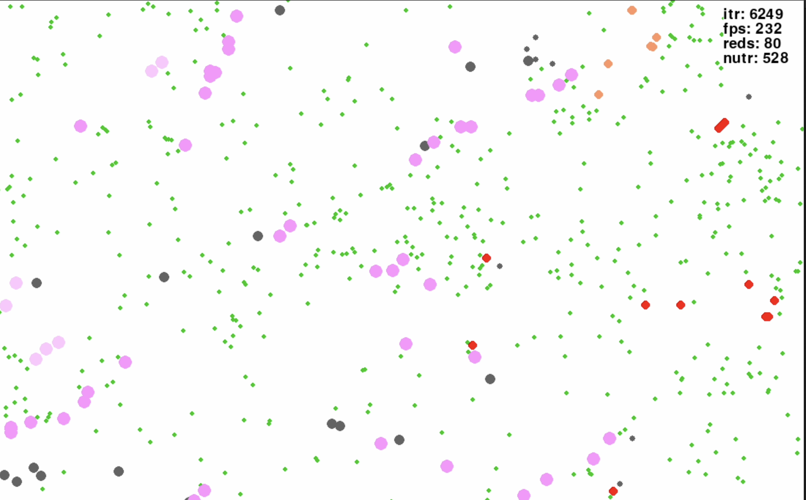
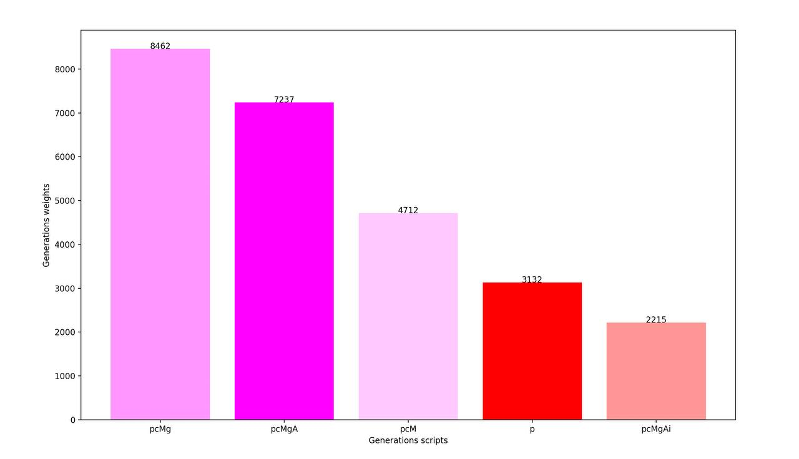
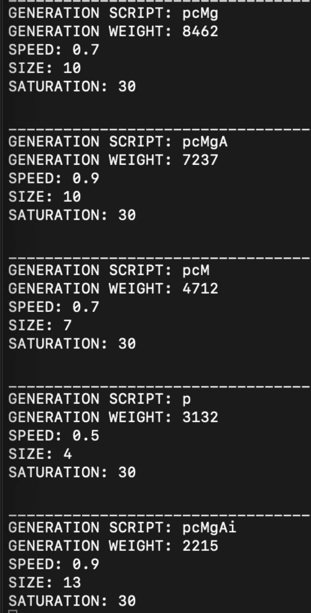
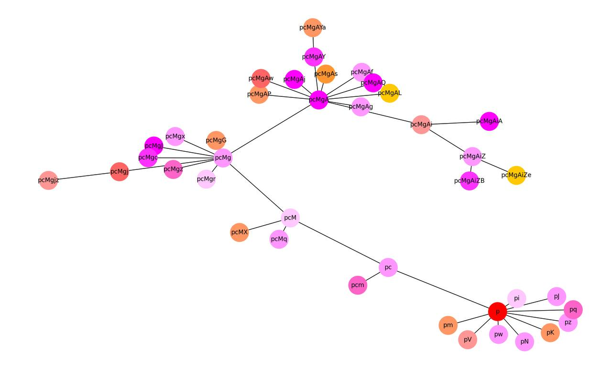
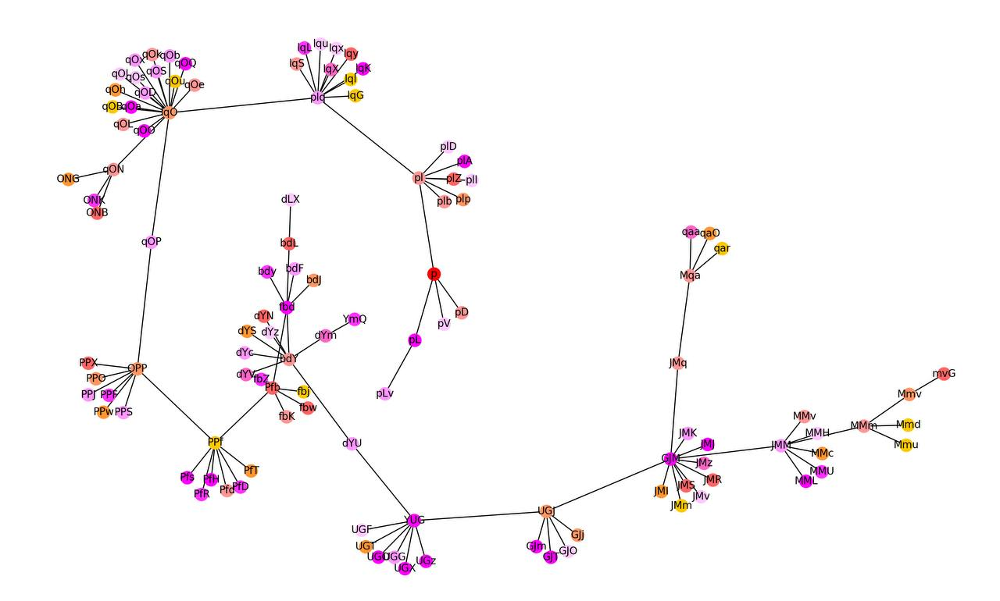

# Evolution simulator

In the course of its meaningless existence, “red”, when dividing, can randomly transfer modified characteristics to its heirs.
For example +2 to size, -0.2 to speed or +5 to saturation.
How this affects development is shown in the simulation.
The improved model should gradually displace its “outdated” ancestors.

## Implemented logic:

### RED ENTITY CLASS:
- search for food (green entities) / choice of goal;
- checking the existence of a green entity/ checking the existence of a selected target;
- eating processing (two methods: the first at ~150 reds reduces the frame rate by 1/3, the second is optimized, copes better with a large number, it seems like it reduced the asymptotic complexity of the algorithm from n^2 to n);
- collision handler (not used in the final version);
- energy increment/decrement;
- division;
- adding a grandparent;

### GREEN ENTITY CLASS:
- adding by counter / iterations;
- adding by keystroke;

All of the above methods constitute a method for updating the state of red and green entities. UPDATE METHOD.

### DATA HANDLER AND PLOT CONSTRUCTOR:

New classes get to work, one is responsible for data processing and implements the compilation of collections according to certain criteria, the second for the graphical component.
The most important is the method that forms a graph; in two rounds I form a list of all generations of entities, then restore family ties between them.
Conveniently organized the numbering of generations. A loop may occur in the graph, since a random selection from a set of characters can produce the same options (evened out by the removal of an element when forming branches of one parent), this has never happened in all runs, the chance of a match in a branch of the same name is extremely low (0.019).

## Screenshots:

1. process

2. stat

3. stat

4. graph 

5. graph 

